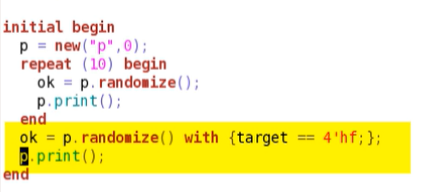

OUTPUT's OBSERVATIONS : 

To test randomization, we edit packet_test.sv to randomize and print 10 instances of print.
If we run this simulation, we can check the constraints. Check target is not 
zero, and the source and target bits do not match.

We can force a constraint violation by adding the inline constraint for target = 
4'hf and then print the packet

We should then see the constraint violation report. It tells us randomization 
failed and prints the conflicting constraints. These are the declarative ts_bits constraint from the packet class, and the 
inline constraint target = 4'hf.

What happens to the packet properties when randomization fails?
The key point is that the packet print after the randomization failure is exactly the 
same as the packet print before the failure.
So, when randomization fails, nothing is changed in the packet and it is as if 
the randomization was never called.

