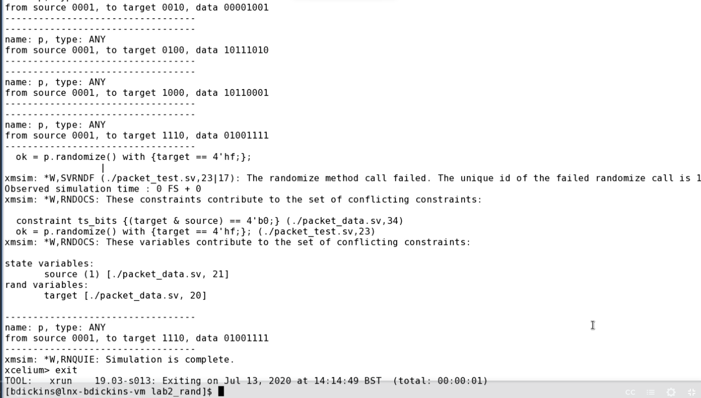
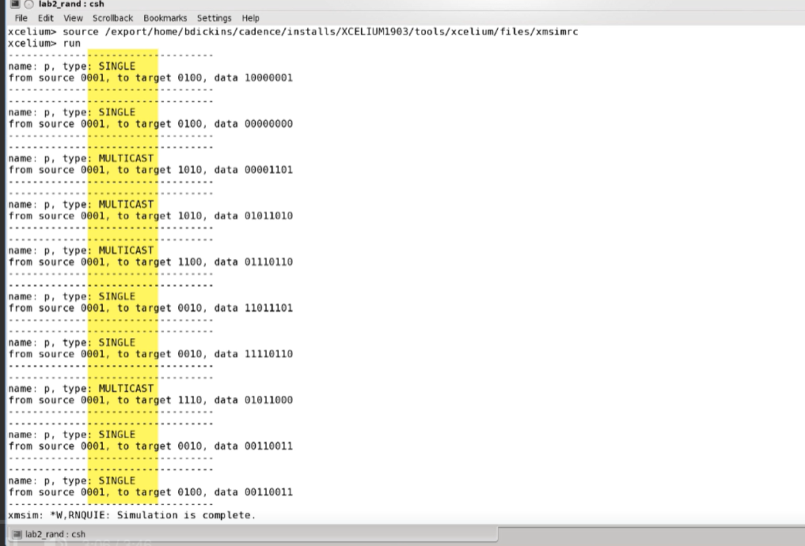
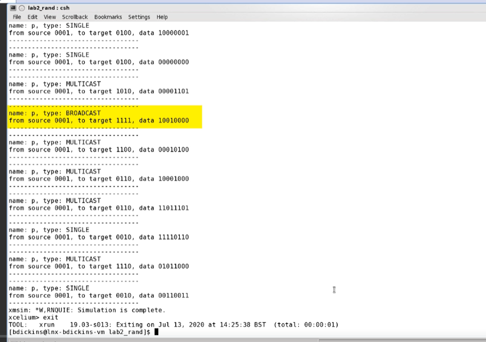

OUTPUT's OBSERVATIONS : 

To test randomization, we edit packet_test.sv to randomize and print 10 instances of print.
If we run this simulation, we can check the constraints. Check target is not 
zero, and the source and target bits do not match.

We can force a constraint violation by adding the inline constraint for target = 
4'hf and then print the packet

We should then see the constraint violation report. It tells us randomization 
failed and prints the conflicting constraints. These are the declarative ts_bits constraint from the packet class, and the 
inline constraint target = 4'hf.

What happens to the packet properties when randomization fails?
The key point is that the packet print after the randomization failure is exactly the 
same as the packet print before the failure.
So, when randomization fails, nothing is changed in the packet and it is as if 
the randomization was never called.

The optional part of this lab is to declare ptype as rand and add conditional 
constraints for target depending on ptype.
In the test module, add the inline constraint to prevent ptype from being ANY, 
and so unconstrained, and then rerun the simulation

Note: you will not get any BROADCAST packets, as the ts_bits constraint 
prevents target being 4'hf.
We should see more MULTICAST packets than SINGLE, as there are 10 
possible targets for MULTICAST and only 4 for SINGLE.
Therefore, with default ordering, MULTICAST packets are approximately twice 
as likely. Here 7 Multicast to 3 Single

        

If I add an order constraint to solve ptype before target, I should get a more 
even distribution. 

Here 6 single to 4 Multicast. We probably need to generate more packets to 
really see the distribution difference

There is no easy way to generate Broadcast packets. We cannot easily turn off the ts_bits constraint from within the conditional 
constraint, but we could comment out the ts_bits constraint and add the expression into 
the conditional branches for Single and Multicast packets.
Remember multiple constraints in each branch need to be enclosed in 
brackets.

When we simulate now, we should generate Broadcast packets. 
            

