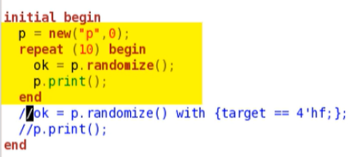
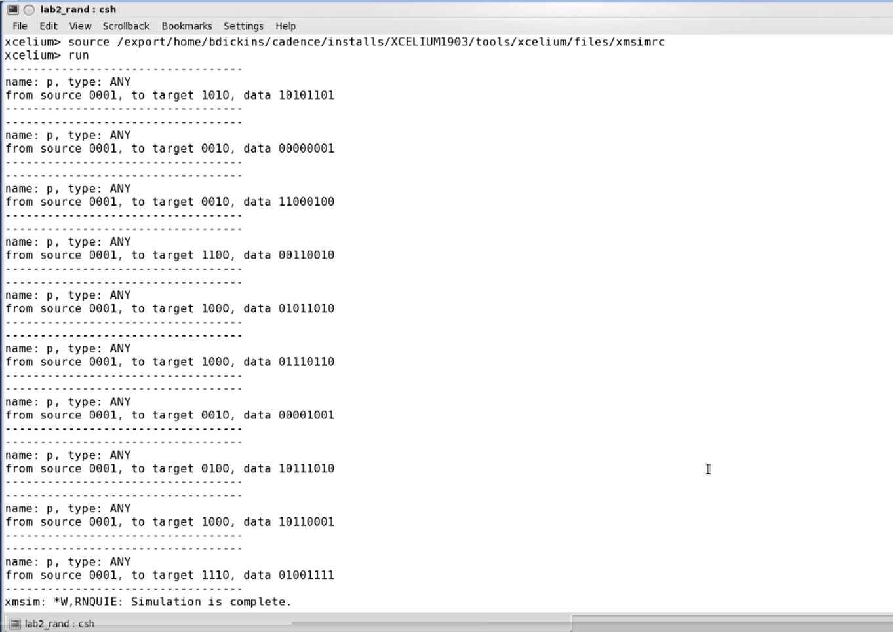
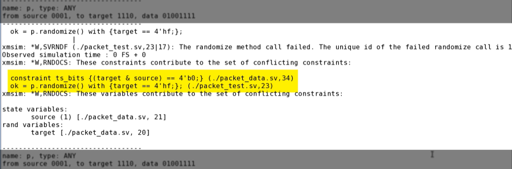
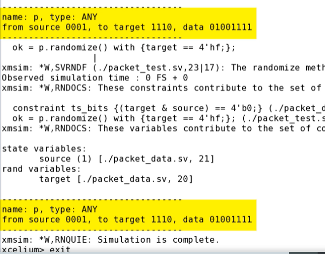
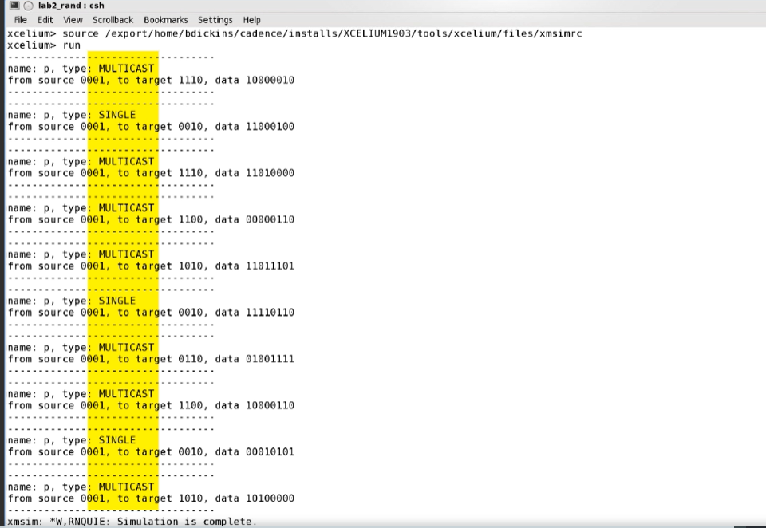

OUTPUT's OBSERVATIONS : 

To test randomization, we edit packet_test.sv to randomize and print 10 instances of print.
If we run this simulation, we can check the constraints. Check target is not 
zero, and the source and target bits do not match.

