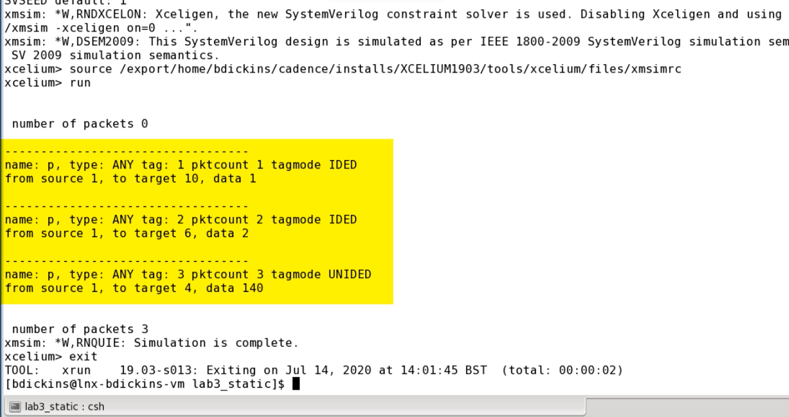

# LAB3: STATIC PROPERTIES AND METHODS

## Objective
The objective of this lab is to add static properties and methods to the `Packet` class.

## Properties Added
1. Static Property - `pktcount` - To count the number of `Packet` instances created.
2. Dynamic Property - `tag` - To store a tag value for each instance.
3. Dynamic Property - `tagmode` - To indicate the tagging mode for each instance.

## Method Added
1. Static Method - `getcount()` - To retrieve the current value of `pktcount`.

**Note:** We declare the `enumerate` type `tag_t` outside the class with the values `UNIDED` and `IDED`, and add the property `tagmode` of `tag_t` type. In a `post_randomize` method, we assign data to `tag` if the `tagmode` is `IDED`. Although `tag` will be unique for each packet instance, the property is not normally part of the packet and so cannot be passed through the DUT and used to, for example, compare corresponding packets in a scoreboard. By assigning `tag` to `data`, `tag` is now part of the packet. The `tagmode` property allows the user to enable this option if required.

## Outputs

The results look like this: zero packets to start. Then the three instances. For the `IDED` packets, `data` is equal to `tag`. For the `UNIDED` packet, `data` is randomized. Finally, reprinting `pktcount` tells us we have created three packet instances.
