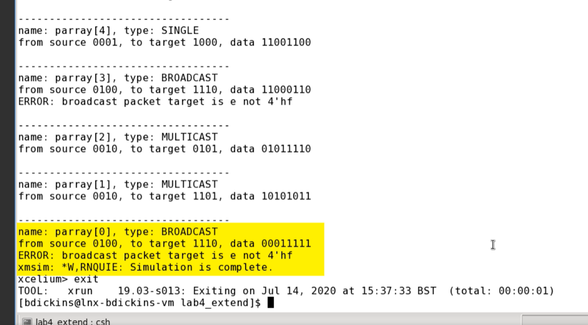

# LAB4: INHERITANCE AND POLYMORPHISM

## Objective
The objective of this lab is to define and use packet subclasses in a programming context.

## Create Packet Sub-classes
1. **`psingle` Subclass:**
   - Constraint: Target has only a one-bit set.

2. **`pmulticast` Subclass:**
   - Constraint: Target has 2-3 bits set.

3. **`pbroadcast` Subclass:**
   - Constraint: Target has all bits set.

## Testing Packet Sub-classes
- Utilize a `foreach` loop to randomly create instances of the packet subclasses.
- Use another `foreach` loop to print each array element.

## Outputs

If there are no errors, validate has not found any issues. However, validate is 
not exhaustive. We should manually check our results and try breaking a subclass to make 
sure validate reports an error. 

So if we change the target constraint on the broadcast packet to 14 instead of 15, We should see an error report. 

